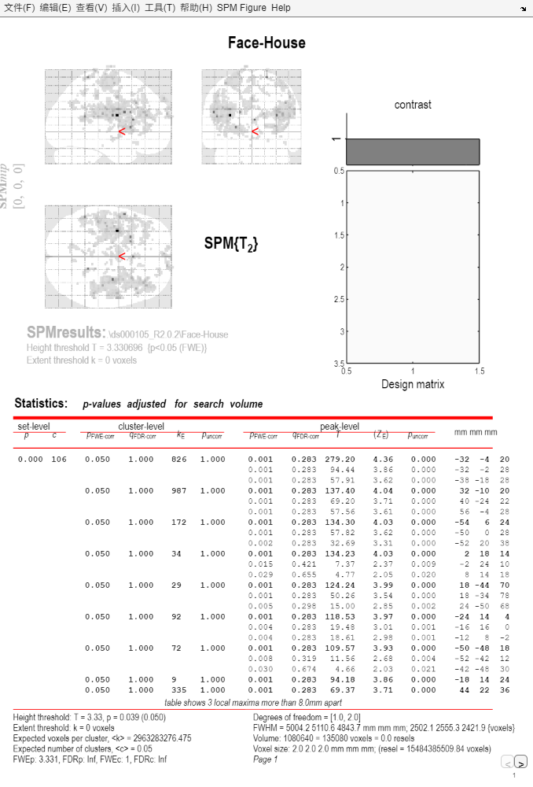

# fMRI Analysis Portfolio: Face > House Group Study

**Author**: 段文晶  
**Date**: May 2026  
**Data**: ds000105 (OpenNeuro)  
**Tools**: MATLAB R2025b, SPM25

## Overview
This repository contains a complete fMRI data analysis pipeline using SPM25. The goal was to examine brain activation for the contrast **Face > House** in a group of participants (N=5). The analysis includes preprocessing, first-level (individual) GLM modeling, and second-level (group) one-sample t-test.

## Analysis Steps
- Preprocessing: Realign, Slice Timing, Normalise (MNI template), Smooth (8mm FWHM)
- First-level: GLM with two conditions (Face, House), duration=0
- Second-level: One-sample t-test on contrast images `con_0001.nii` (Face > House)

## Key Results (Group Level)
**Threshold**: FWE-corrected p < 0.05, extent threshold k = 0

Significant activation was found in bilateral frontal, parietal, and cingulate regions.

| MNI coordinates (x, y, z) | T-value | Approximate region |
|---------------------------|---------|---------------------|
| -32, -4, 20               | 279.20  | Left precentral gyrus |
| 32, -10, 20               | 137.40  | Right precentral gyrus |
| -54, 6, 24                | 134.30  | Left inferior frontal gyrus |
| 2, 18, 14                 | 134.23  | Anterior cingulate cortex |

Full statistical table is shown below:

## Repository Structure
- `scripts/` – MATLAB batch scripts for preprocessing, first-level, and second-level analysis
- `results/` – Statistical table and design matrix
- `docs/` – Experimental design documentation (will be added later)

## How to Reproduce
1. Install MATLAB and SPM25.
2. Download the ds000105 dataset from OpenNeuro.
3. Modify the root path in the scripts to point to your data location.
4. Run the scripts in order: preprocessing → first-level → second-level.

## Future Directions
- ROI analysis (Marsbar)
- Functional connectivity (CONN)
- Representational similarity analysis (RSA)
